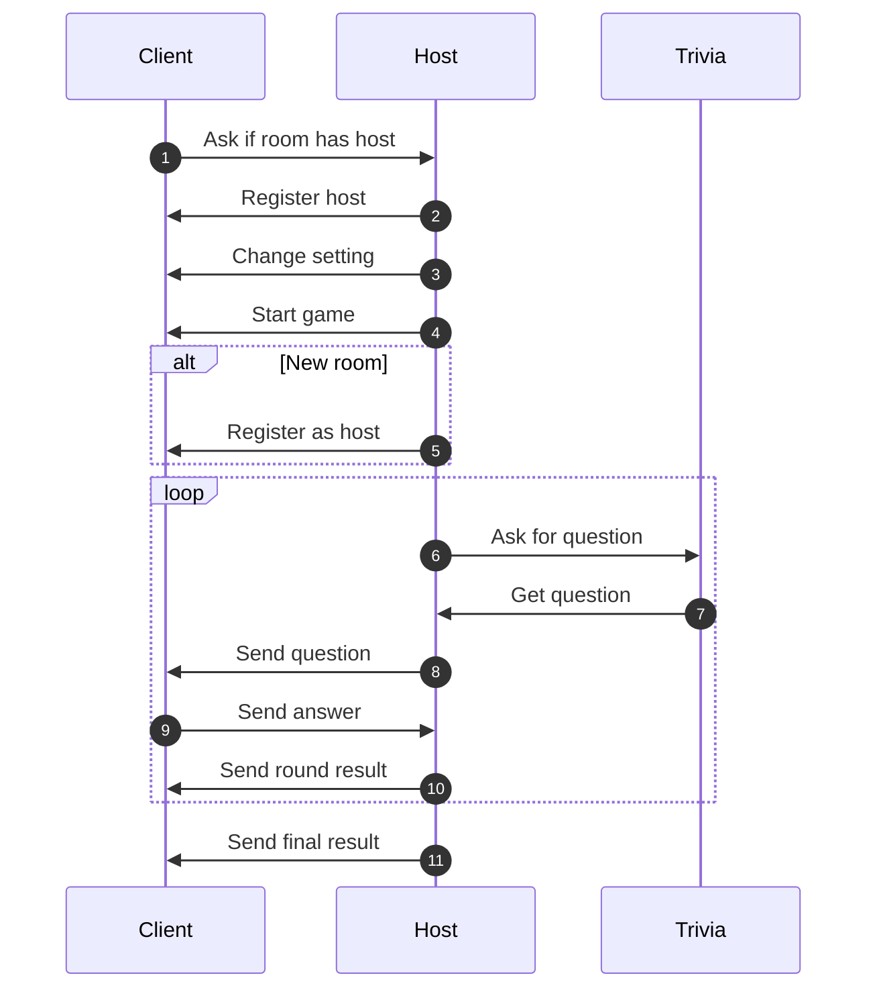

```mermaid
sequenceDiagram
    autonumber
    Client->>Host: Ask if room has host
    Host->>Client: Register host
    Host->>Client: Change setting
    Host->>Client: Start game

    alt New room
        Host->>Client: Register as host
    end

    loop
        Host->>Trivia: Ask for question
        Trivia->>Host: Get question
        Host->>Client: Send question
        Client->>Host: Send answer
        Host->>Client: Send round result
    end
    Host->>Client: Send final result
```
